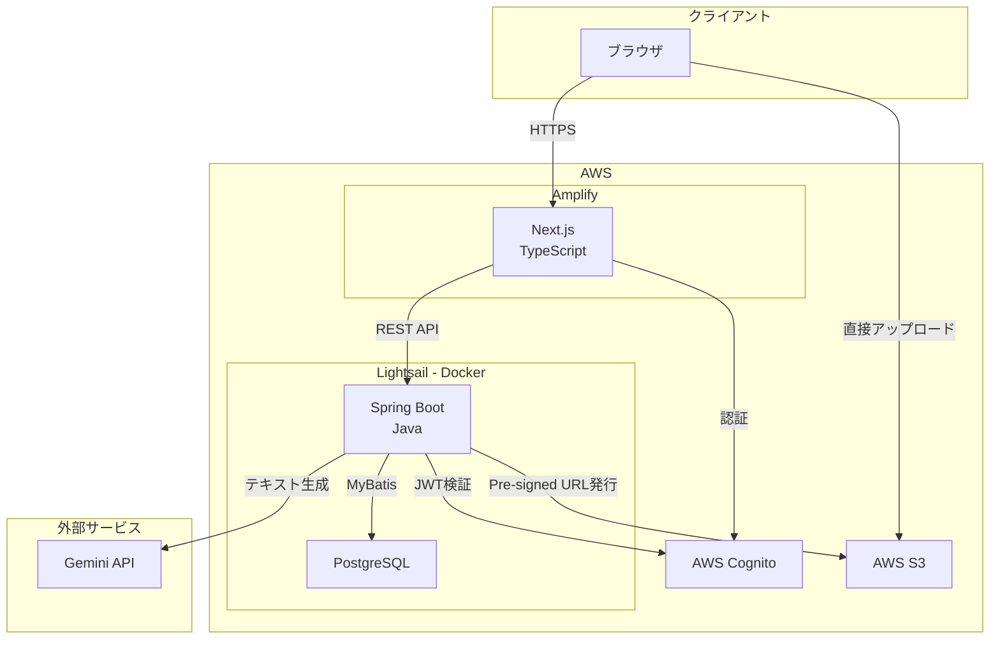
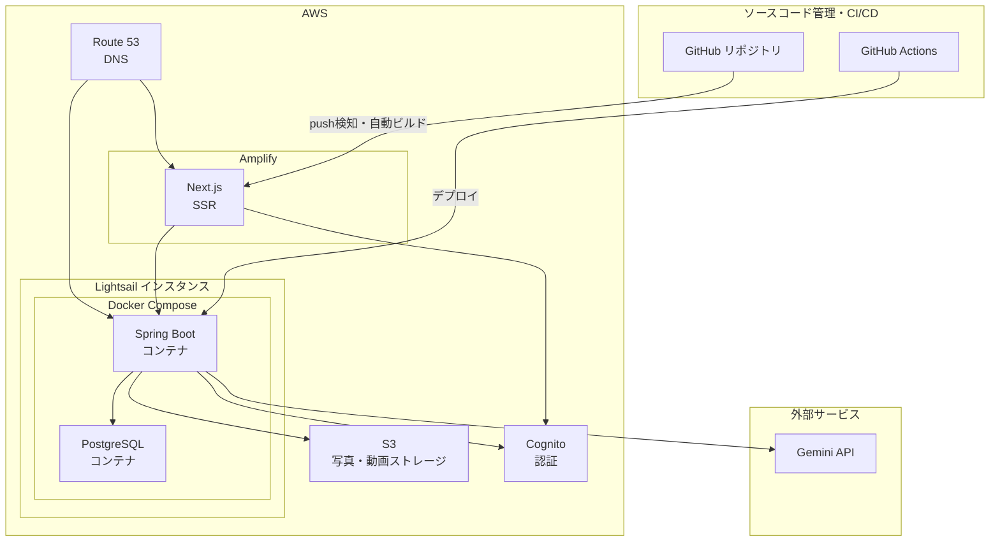

# アーキテクチャ設計書

## システム全体構成図



## レイヤー構成

### フロントエンド

選定理由：Bulletproof Reactの設計思想をベースに、機能単位でコードを分割する構成を採用

```
フロントエンド: Next.js
├── App Layer            : ルーティング、レイアウト、プロバイダー設定
├── Feature Layer        : 機能別モジュール（api / components / hooks / types）
├── Shared Layer         : 機能横断の共通コンポーネント・hooks・utils
├── Lib Layer            : OpenAPI Generator生成のAPIクライアント、外部ライブラリ設定
└── Type Layer           : 共通の型定義
```

### バックエンド

選定理由：SpringBootで一般的に使用される三層アーキテクチャをベースに自動生成用のModelレイヤーとその他認証、設定に必要なレイヤーを設定

```
バックエンド: Spring Boot
├── Controller Layer     : REST APIエンドポイント
├── Service Layer        : ビジネスロジック、トランザクション管理
├── Repository Layer     : データアクセス、MyBatisマッパー呼び出し
├── Model Layer          : エンティティ、DTO
├── Security Layer       : 認証フィルター、JWT検証
└── Config Layer         : Bean定義、外部サービス設定
```

## デプロイ構成



## セキュリティ設計概要

### 認証方式

- AWS Cognitoを認証基盤として採用し、JWTによるステートレス認証を行う
- フロントエンドはCognitoからJWTを取得し、APIリクエストのAuthorizationヘッダーに付与する
- バックエンドはSpring SecurityのフィルターでJWTを検証し、リクエストの正当性を確認する

### ユーザー管理方針

- 新規登録機能は設けず、ユーザーはAWSコンソール上での手動追加のみとする
- 対象ユーザーが親族のみであるため、外部からの不正登録リスクを最小にすることを優先

### 権限管理

| ロール | 想定ユーザー | 操作範囲 |
|--------|-------------|----------|
| 管理者 | 自分・妻 | 全機能の操作が可能 |
| 閲覧者 | 祖父母・兄弟姉妹 | 写真・動画の閲覧、一部の育児記録の閲覧、コメント・いいねのみ可能 |

## データ管理方針

### データの分離

- **メディアデータ（写真・動画）**: AWS S3に保存
- **アプリケーションデータ（育児記録・メタデータ・ユーザー情報等）**: PostgreSQLに保存

### 分離の設計意図

- メディアファイルをDB/LightSailストレージに保存するとバックアップやスケールに制約が生じるため
- メタデータのみをDBで管理することで、検索・フィルタリング・タグ管理などの機能をSQLで柔軟に実装できるため

### バックアップ方針

- PostgreSQLのデータはcronとpg_dumpによる日次自動バックアップを実施し、バックアップファイルはS3に保存する
- S3上の写真・動画はS3のバージョニング機能により保護する
- バックアップの保持期間は30日とする

## その他設計ドキュメント
- [テーブル定義書](./table-definition.md)
- [ER図](./er-diagram.md)
- [画面設計書](./screen-spec.md)
- [API仕様](./openapi.yaml)
- [シーケンス図](./sequence.md)