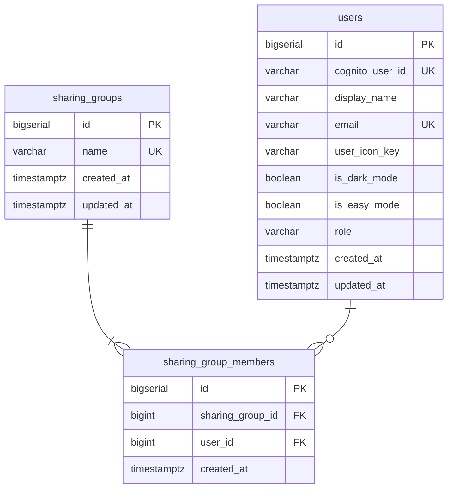
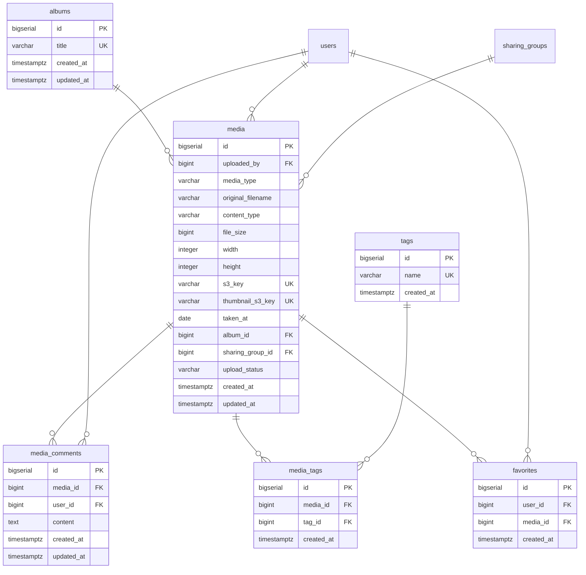
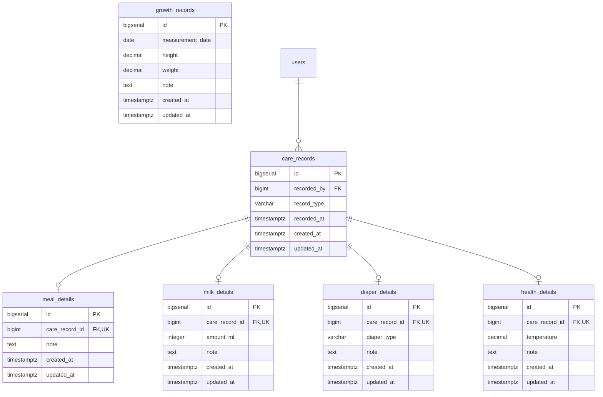
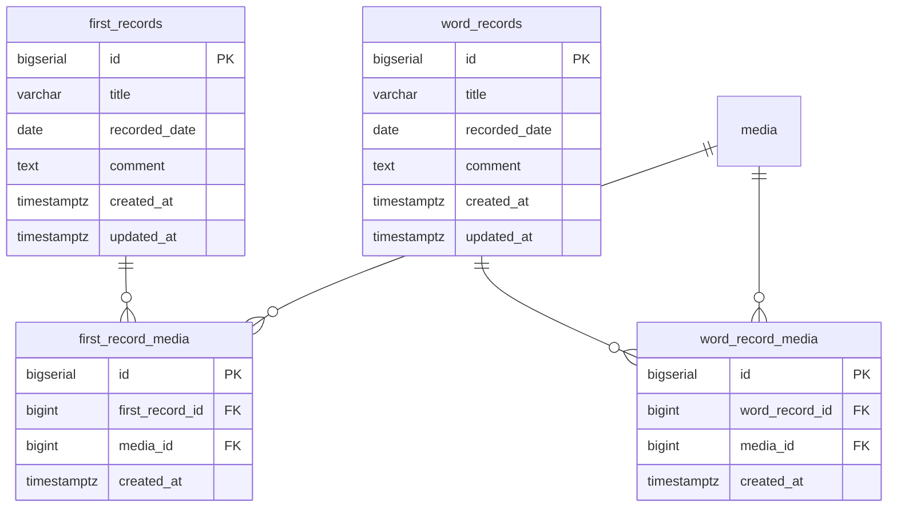
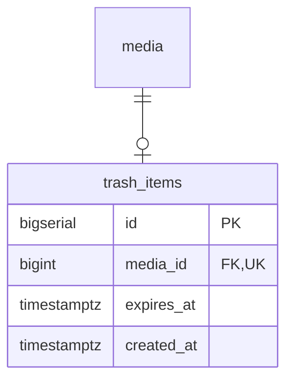

# ER図

## 概要

DB基本情報・共通設計方針は[テーブル定義書](table-definition.md)を参照

テーブル数が多いため、各セクションごとに分割して表示

### ユーザー・権限

### 写真・動画

### 育児記録

### はじめて・ことば

### ゴミ箱

## その他設計ドキュメント
- [アーキテクチャ設計書](./architecture.md)
- [テーブル定義書](./table-definition.md)
- [画面設計書](./screen-spec.md)
- [API仕様](./openapi.yaml)
- [シーケンス図](./sequence.md)
