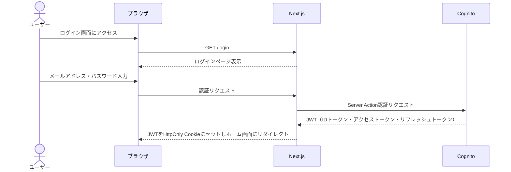
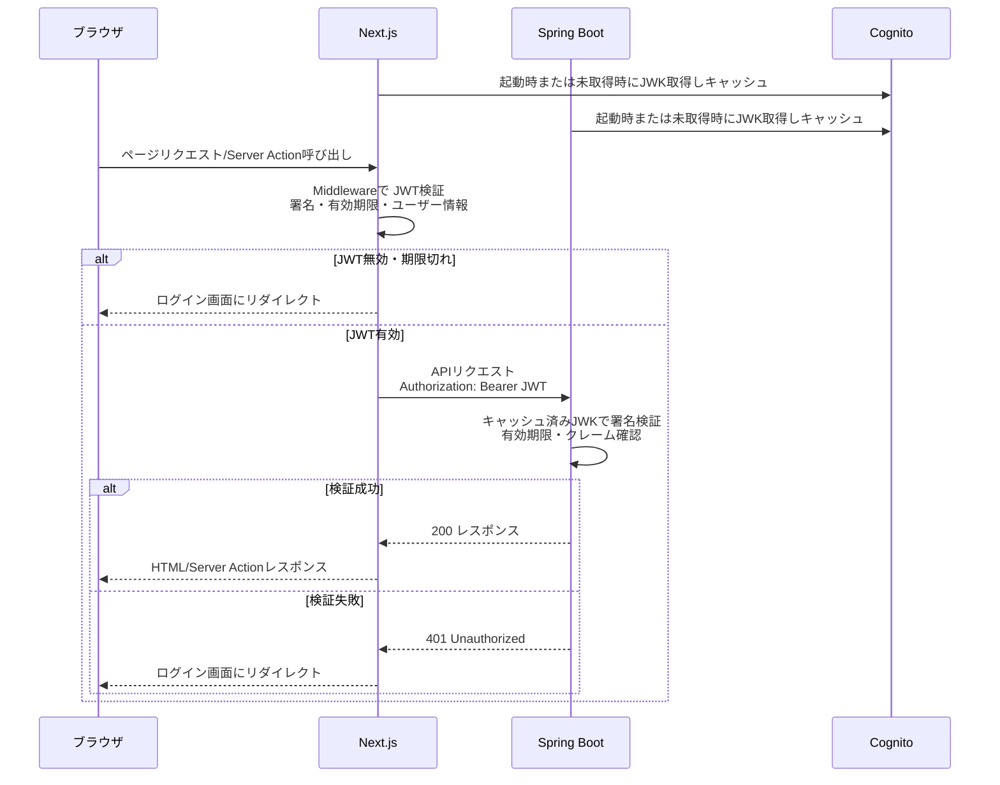
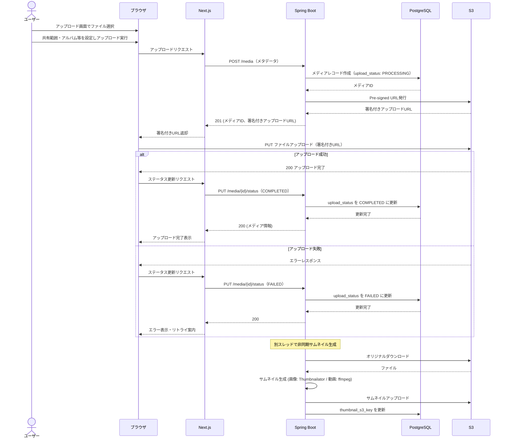
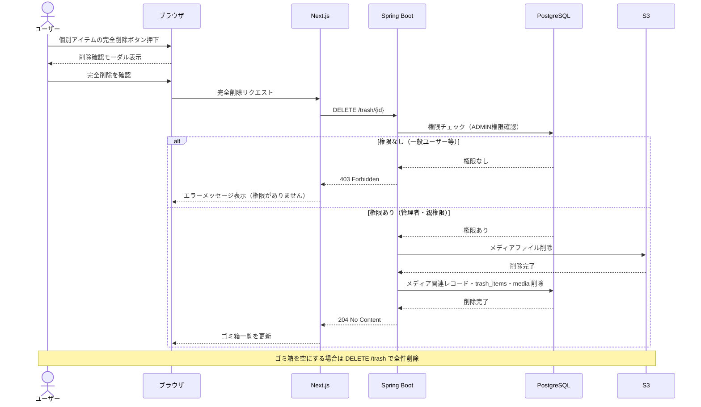
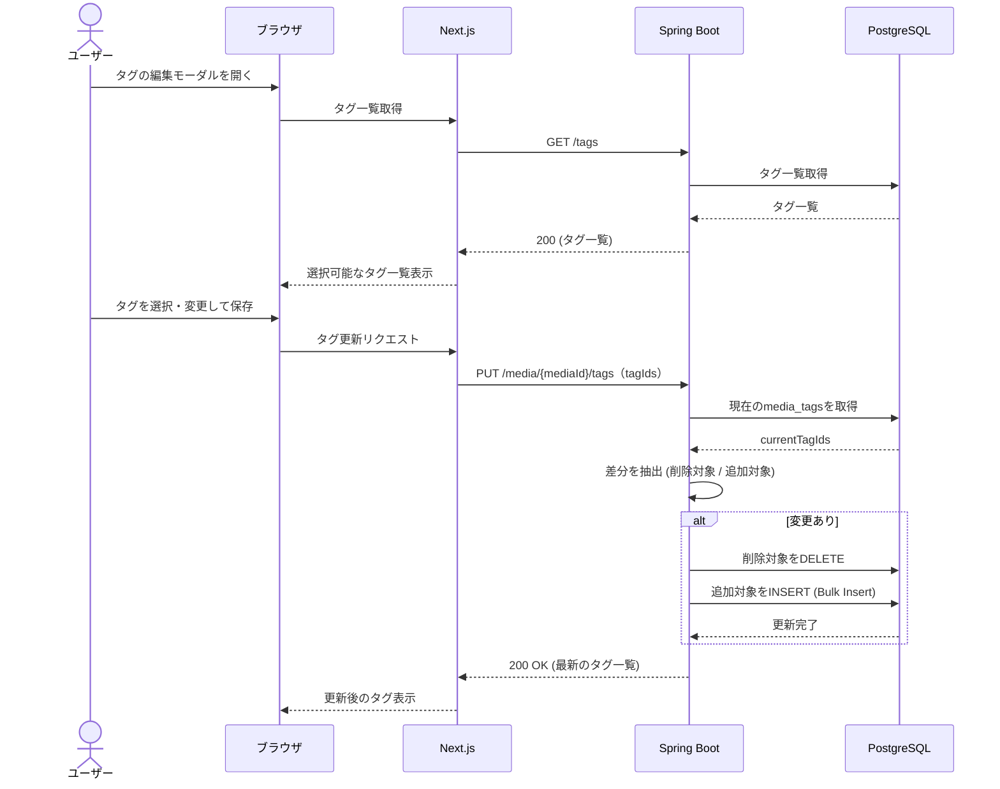
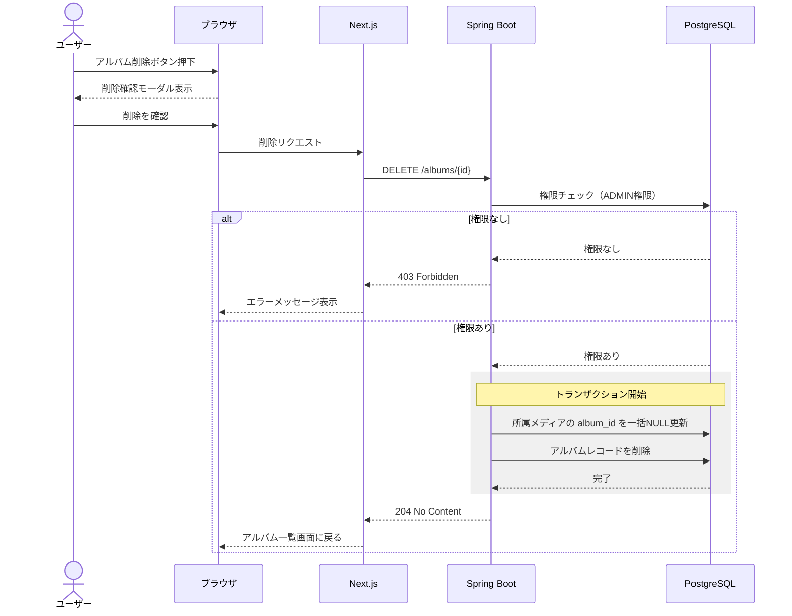
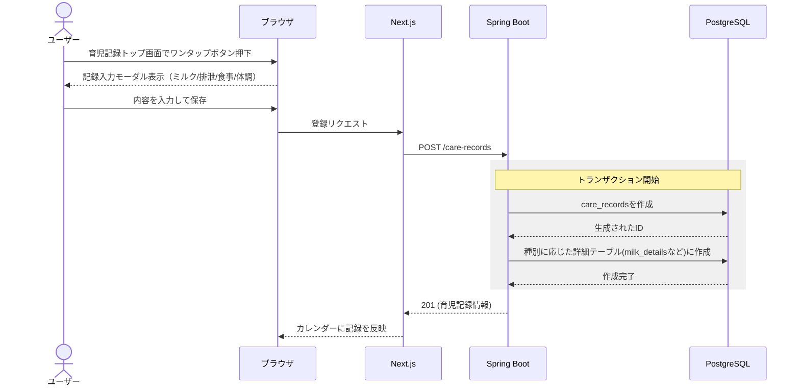
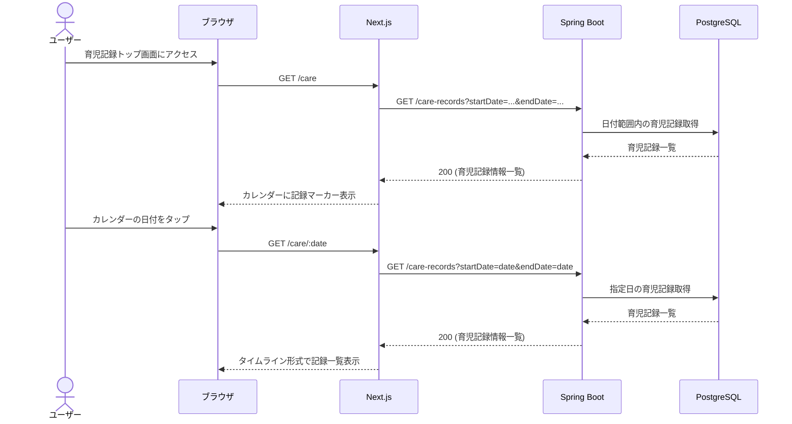
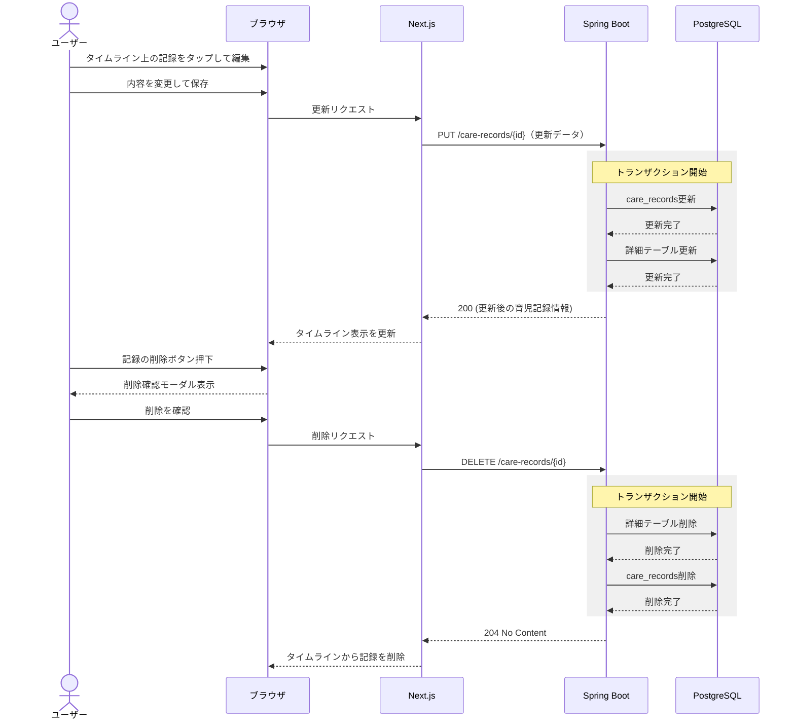

# シーケンス図

## 概要

処理が複雑化する箇所をシーケンス図で記載

### 登場コンポーネント

| コンポーネント | 説明                                      |
| -------------- | ----------------------------------------- |
| ブラウザ       | ユーザーが操作するクライアント            |
| Next.js        | Amplify上のフロントエンドアプリケーション |
| Cognito        | 認証基盤                                  |
| Spring Boot    | Lightsail上のバックエンドAPIサーバー      |
| PostgreSQL     | データベース                              |
| S3             | 写真・動画ストレージ                      |

## 各種シーケンス

### ログイン

### 認証付きAPIリクエスト

### 写真・動画アップロード

### ゴミ箱から完全削除

### タグの更新

### アルバム削除

### 育児記録の登録

### 育児記録一覧取得(カレンダー形式 / タイムライン形式)

### 育児記録の更新・削除

## その他設計ドキュメント

- [アーキテクチャ設計書](./architecture.md)
- [テーブル定義書](./table-definition.md)
- [ER図](./er-diagram.md)
- [画面設計書](./screen-spec.md)
- [API仕様](./openapi.yaml)
